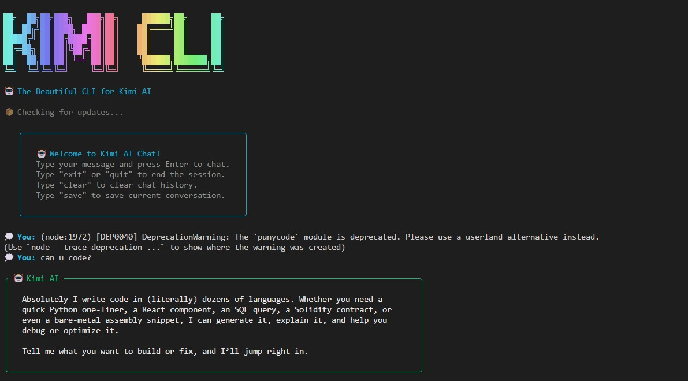
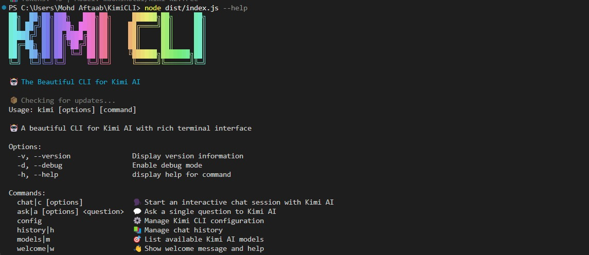

# Kimi CLI 🤖

<div align="center">



*A beautiful command-line interface for Kimi AI with rich visuals and interactive features*

[](https://www.npmjs.com/package/kimiai-cli)
[](./LICENSE)
[](https://github.com/MoAftaab/kimi-cli)

</div>

## ✨ Features

- 🎨 **Beautiful Terminal UI** - Rich colors, gradients, and ASCII art
- 💬 **Interactive Chat** - Real-time conversations with Kimi AI
- ❓ **Quick Questions** - Ask single questions instantly
- 📚 **Chat History** - Save and manage conversation sessions
- ⚙️ **Easy Configuration** - Simple setup and customization
- 🎯 **Multiple Models** - Support for various Kimi AI models
- 🚀 **Cross-Platform** - Works on Windows, macOS, and Linux



## 🚀 Quick Start

```bash
# Global installation
npm install -g kimiai-cli

# Verify installation
kimi --version

# Start using
kimi config set-key    # Set API key
kimi ask "Hello!"      # Ask a question
kimi chat              # Start interactive chat
```

### Setup
1. Get your API key from [OpenRouter](https://openrouter.ai/keys)
2. Configure the CLI:
   ```bash
   kimi config set-key
   ```
3. Start using:
   ```bash
   kimi ask "Hello, how are you?"
   ```

## 💬 Usage

### Basic Commands
```bash
kimi chat                     # Interactive chat session
kimi ask "your question"      # Single question
kimi config show              # View configuration
kimi history list             # View chat history
kimi models                   # List available models
kimi about                    # Developer information
```

### Advanced Usage
```bash
# Use specific model
kimi ask "Explain AI" --model moonshotai/moonshot-v1-32k

# Adjust creativity
kimi chat --temperature 1.5

# Limit response length
kimi ask "Brief explanation" --max-tokens 100
```

## 🎯 Available Models

| Model | Context | Type | Best For |
|-------|---------|------|----------|
| `moonshotai/kimi-k2:free` | 8K | Free | Quick questions, testing |
| `moonshotai/moonshot-v1-8k` | 8K | Paid | Standard conversations |
| `moonshotai/moonshot-v1-32k` | 32K | Paid | Long documents, analysis |
| `moonshotai/moonshot-v1-128k` | 128K | Paid | Complex tasks, large files |

## ⚙️ Configuration

```bash
# API Key Management
kimi config set-key                    # Interactive setup
kimi config set-key sk-or-v1-your-key # Direct setup

# Settings
kimi config set defaultModel moonshotai/moonshot-v1-32k
kimi config set maxTokens 2000
kimi config set temperature 0.8
kimi config reset                      # Reset to defaults
```

## 🛠️ Development

```bash
# Clone and setup
git clone https://github.com/MoAftaab/kimi-cli.git
cd kimi-cli
npm install
npm run build

# Development
npm run dev
npm link
```

## 🤝 Contributing

1. Fork the repository
2. Create a feature branch
3. Make your changes
4. Submit a pull request

## 📞 Support

- 🐛 [Report Issues](https://github.com/MoAftaab/kimi-cli/issues)
- 💬 [Discussions](https://github.com/MoAftaab/kimi-cli/discussions)

## 📄 License

MIT License - see [LICENSE](LICENSE) file for details.

---

<div align="center">

**Made with ❤️ by [MOHD AFTAAB](https://github.com/MoAftaab)**

📧 [moaftaab786@gmail.com](mailto:moaftaab786@gmail.com) • 🐙 [GitHub](https://github.com/MoAftaab)

[](https://github.com/MoAftaab/kimi-cli)
[](https://github.com/MoAftaab/kimi-cli/fork)

</div>
